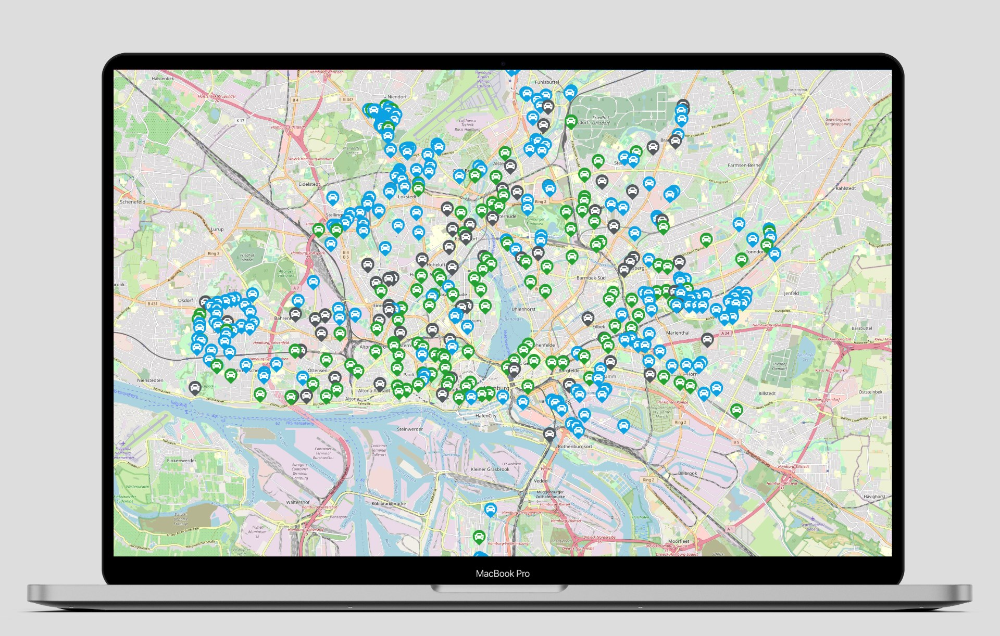

# Share Now car locations
Here is [demo page](https://t3rm1.github.io/share-now-api/) that shows the locations of all Share Now cars. Only cars in Hamburg are shown right now.

:warning: _Link does not work at the moment as I don't have a server for node. Please run the project locally._

Green markers are cars that became available.

Grey markers are cars that became unavailable.

## Usage
```
npm install
node server.js
```
Go to [http://localhost:8080](http://localhost:8080).


## MQTT
The data is serverd by a MQTT broker. For Europe the endpoint is `mqtts://driver.eu.share-now.com:443`. The clientId is a random UUID prefixed with `a:` for anonymous connections. No username and password are required.

You can subscribe to multiple topics. The schema is `C2G/S2C/<locationId>/<topic>.GZ` where `topic` is either `VEHICLELIST` or `VEHICLELISTDELTA`.

Possible `locationId` values are:

- Germany
    - Hamburg - `3`
    - Berlin - `12`
    - Frankfurt am Main - `33`
    - München - `26`
    - Köln - `19`
    - Stuttgart - `18`
- Italy
    - Milan - `20`
    - Rome - `31`
    - Turin - `44`
- Other countries
    - Copenhagen - `52`
    - Paris - `48`
    - Amsterdam - `5`
    - Vienna - `7`
    - Madrid - `36`
    - Budapest - `55`

The data received is json compressed with gzip.

### VEHICLELIST
Subscriptions to this topic will give you a list with all cars for the given location. A message is sent each time there is an update, so you should unsubscribe as soon as you get the first message.

<details>
    <summary>Example</summary>

```json
{
    "connectedVehicles": [
        {
            "id": "WBY8P210107E82494",
            "plate": "M-EV1558E",
            "geoCoordinate": {
                "latitude": 53.57132,
                "longitude": 9.95367
            },
            "fuellevel": 84,
            "address": "Fruchtallee 107, 20259 Hamburg",
            "locationId": "3",
            "buildSeries": "BMW_I3",
            "fuelType": "ELECTRIC",
            "primaryColor": "B85U",
            "hardwareVersion": "HW42",
            "imageUrl": "https://www.car2go.com/rentalassets/vehicles/{density}/bmw_i3_capparis_white.png",
            "transmission": "GA",
            "rank": 1,
            "vin": "WBY8P210107E82494",
            "locationIdAsLong": 3
        }
    ],
    "locationId": 3,
    "eventType": "CONNECTED_VEHICLES",
    "timestamp": 1589666154706
}
```
</details>

### VEHICLELISTDELTA
This topic receives messages whenever a car becomes available or unavailable.

<details>
    <summary>Example</summary>

```json
{
    "addedVehicles": [
        {
            "id": "WME4533421K323858",
            "plate": "HH-GO8560",
            "geoCoordinate": {
                "latitude": 53.55533,
                "longitude": 10.02782
            },
            "fuellevel": 59,
            "address": "Jungestra\u00c3\u0178e 6, 20535 Hamburg",
            "locationId": "3",
            "buildSeries": "C453",
            "fuelType": "GASOLINE",
            "primaryColor": "EN2U",
            "secondaryColor": "EDAO",
            "hardwareVersion": "HW3",
            "imageUrl": "https://www.car2go.com/rentalassets/vehicles/{density}/c453_silver.png",
            "transmission": "GA",
            "rank": 1,
            "vin": "WME4533421K323858",
            "locationIdAsLong": 3
        }
    ],
    "removedVehicles": [
        "WME4533421K291769"
    ],
    "locationId": 3,
    "timestamp": 1589656739007,
    "eventType": "VEHICLE_LIST_UPDATE"
}
```
</details>

### Code
All Share Now api related code is in [sharenow.js](sharenow.js). Rest of the files are for the demo webpage.